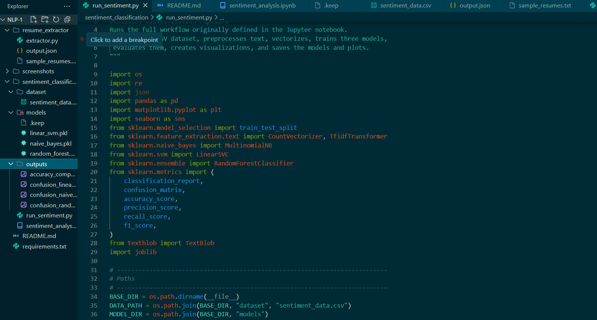
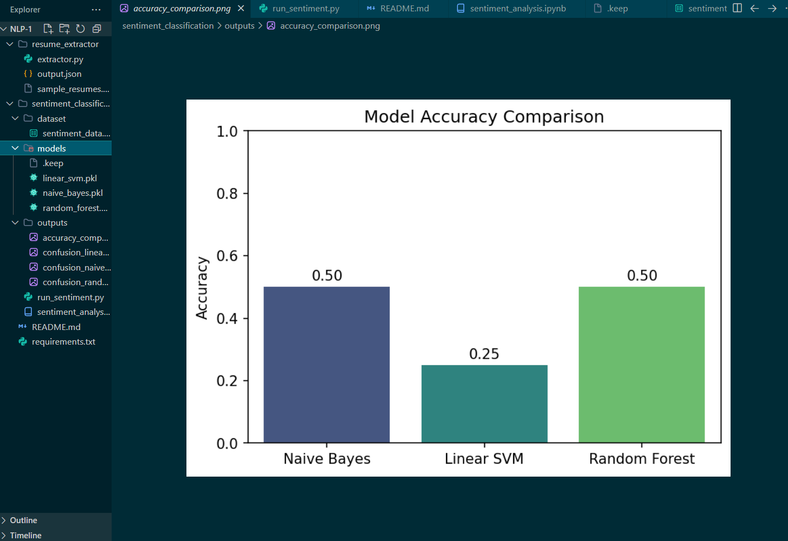
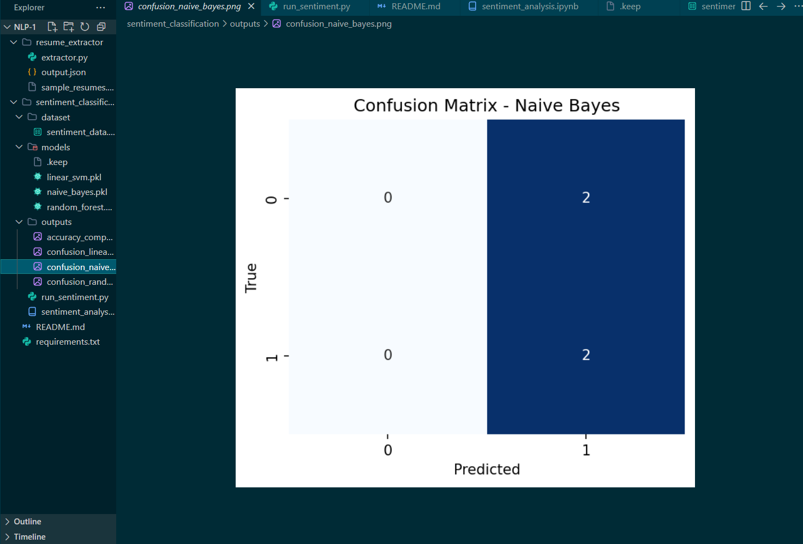
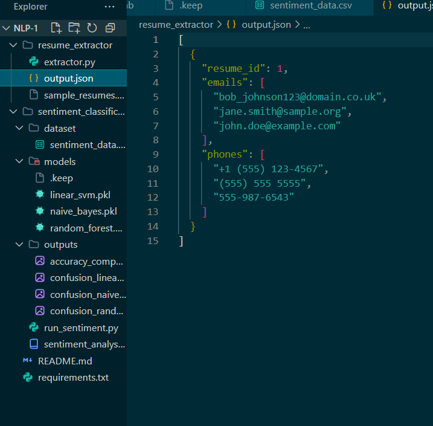
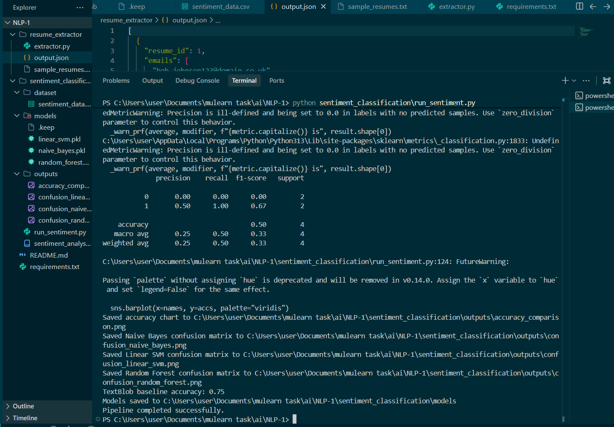

# NLP Resume Extractor & Sentiment Analysis

## Project Overview

This project contains two NLP tasks:

### Resume Information Extractor
- Extracts email addresses using Regex
- Extracts phone numbers using Regex
- Saves extracted information into structured JSON format

### Sentiment Classification
- Text preprocessing using NLP techniques
- TF-IDF vectorization
- Machine Learning models:
  - Naive Bayes
  - Linear SVM
  - Random Forest
- TextBlob baseline comparison
- Accuracy comparison visualization
- Confusion matrix generation

---

# Technologies Used

- Python
- scikit-learn
- nltk
- TextBlob
- pandas
- matplotlib
- seaborn

---

# Project Structure

```bash
NLP-1/
│
├── resume_extractor/
├── sentiment_classification/
├── screenshots/
├── README.md
└── requirements.txt
```

---

# Screenshots

## Project Structure & Accuracy Comparison



---

## Accuracy Comparison Graph



---

## Confusion Matrix



---

## Resume Extractor JSON Output



---

## Successful Terminal Execution



---

# How To Run

## Install dependencies

```bash
pip install -r requirements.txt
```

---

## Run Resume Extractor

```bash
python resume_extractor/extractor.py
```

---

## Run Sentiment Classification

```bash
python sentiment_classification/run_sentiment.py
```

---

# Output Features

- Extracted Emails & Phone Numbers
- Structured JSON Output
- Accuracy Comparison Graph
- Confusion Matrix Heatmaps
- Saved Trained ML Models
